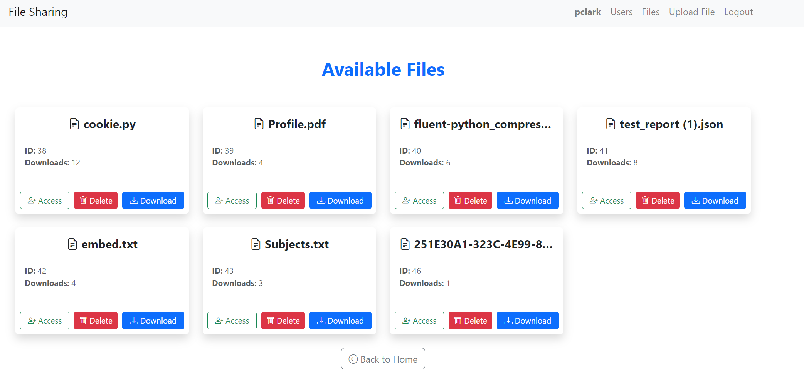

# File Sharing Web Application

A secure and efficient **file-sharing platform** built with FastAPI, designed to manage and regulate user access to uploaded files. This platform supports two user roles: **Admin** and **Regular User**, offering tailored features for each.

---

## Features

### Admin Features
- **File Uploads**: Upload files to the server.
- **Access Management**: Assign or revoke download permissions for regular users.
- **File Management**: 
  - View all uploaded files.
  - Delete files and their database records.
  - Monitor download counts for each file.
- **Activity Logs**: Track file downloads with details like username, file name, and timestamp.

### Regular User Features
- **File Access**: View a list of files granted access by the admin.
- **File Download**: Download authorized files.

### Shared Features
- **Authentication**: Secure login and registration system.
- **User Registration**: New users can sign up using a unique username, email, and password.
- **Responsive Design**: Mobile-friendly and visually appealing UI.

---

## Technologies Used

### Backend
- **Framework**: FastAPI
- **Database**: MySQL
- **ORM**: SQLAlchemy
- **File Storage**: Files are stored securely in the server's filesystem.
- **CSRF Protection**: Secure requests using CSRF tokens.

### Frontend
- **HTML/CSS**: Custom templates with Bootstrap for styling.
- **JavaScript**: Dynamic user interactions (AJAX for form submission).

### Other Features
- **Authentication**: Login and registration using secure hashed passwords.
- **Logging**: Tracks file download activity for monitoring.

---

## Project Setup

### Prerequisites
- Python 3.12+
- MySQL

### Installation
1. **Clone the Repository**:
   ```bash
   git https://github.com/MasakDirt/file-sharing.git
   cd file-sharing
   ```

2. **Create a Virtual Environment**:
   ```bash
   python -m venv venv
   source venv/bin/activate  # On Windows: venv\Scripts\activate
   ```

3. **Install Dependencies**:
   ```bash
   pip install -r requirements.txt
   ```

4. **Set Up the .env file**:
   - You can find example in [.env.sample](.env.sample) file
   - Or set manually:
   ```bash
    set MYSQL_DATABASE=<YOUR_DATABASE_NAME>
    set MYSQL_USER=<YOUR_USER>
    set MYSQL_PASSWORD=<YOUR_PASSWORD>
    set MYSQL_ROOT_PASSWORD=<YOUR_ROOT_PASSWORD>
    set HOST=<localhost>
    
    set DEBUG=False
    
    set CSRF_SECRET_KEY=<YOUR_SECRET_FOR_CSRF>
   ```

5. **Run Migrations**:
   ```bash
   alembic upgrade head
   ```

6. **Start the Development Server**:
   ```bash
   uvicorn src.main:app
   ```

7. **Access the Application**:
   - Open your browser and navigate to `http://127.0.0.1:8000`.

---

## Project Setup with Docker

1. **Clone the Repository**:
   ```bash
   git https://github.com/MasakDirt/file-sharing.git
   ```
2. **Set Up the .env file like in [.env.sample](.env.sample)**

3. **Run docker**:
    ```bash
   docker-compose up --build
    ```


---

## API Endpoints

### Authentication
- `POST /login/` - Login with email and password.
- `POST /register/` - Register a new user.

### Admin Routes
- `GET /users/` - View all users.
- `GET /files/` - View all uploaded files and download counts.
- `POST /files/upload/` - Upload a new file.
- `POST /files/<file_id>/delete/` - Delete a file.
- `POST /files/<file_id>/access/` - Manage user permissions for a file.

### Regular User Routes
- `GET /files/my/` - View accessible files.
- `GET /files/<file_id>/download/` - Download a file.

---

## Bonus Features
- **Download Logging**:
  - Each file download is logged with:
    - Username
    - File name
    - Timestamp

---

## Future Enhancements
- **Role-Based Dashboard**: Dedicated dashboards for admins and regular users.
- **File Preview**: Inline preview for documents and images before downloading.
- **Notification System**: Alert users when new files are shared with them.

---

## Screenshots

**Admin Dashboard**  


**Regular User Interface**  

